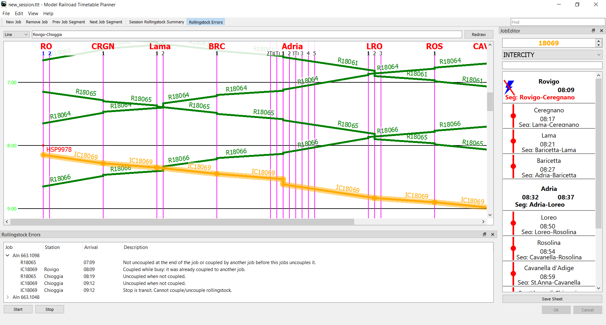

# ModelRailroadTimetablePlanner

[Versione in italiano](README_it.md)

Formerly **TrainTimetable**

A cross-platform C++ application with Qt GUI for model railway timetable scheduling.
*Currently tested on Windows and Ubuntu.*

By Filippo Gentile

## Screenshots

## Goals

The goal of the project is to implement
automatic mechanism which prevent invalid
operations and suggest user with useful action
in order to speed up the creation of timetables.

The programs aims to provide all documents useful
for driving and dispatching trains on big layouts like in FREMO Meetings.

## Main features
- Available UI languages: English, Italian
- Railway timetable graph per each line in SVG, PDF or printed
- Group jobs (trains) in work shift
- Export booklets in ODT (LibreOffice Writer) for shifts and stations
- Importation of rollingstock pieces from other sessions or ODS Spreadsheet

## Project history
The development started as a small hobby project back in 2016,
in collaboration with Italian FREMO organizations.
It was rewritten from scratch due to core instabilities and limitations.
Since then it has grown unexpectedly.
So I'd like it to become a community project!

## Project motto

Less time spent on the computer,
more time to have fun on your railway layout!!!

## Contributing to the project

Please see [CONTRIBUTING.md](CONTRIBUTING.md) file.
