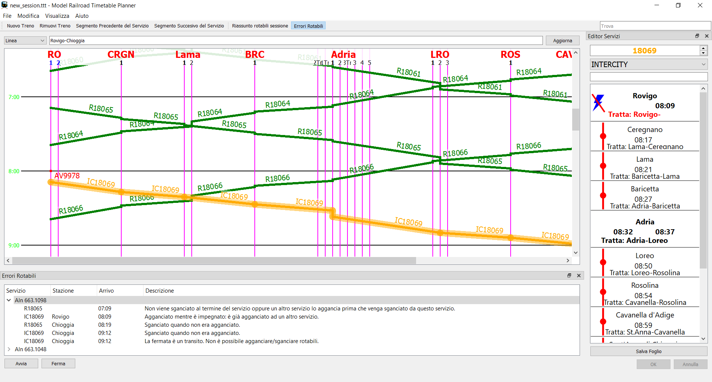

# ModelRailroadTimetablePlanner

[English version](README.md)

Precedentemente noto come **TrainTimetable**

Un programma multipiattaforma C++ con GUI Qt (interfaccia grafica) per creare orari di treni per plastici ferroviari.
*Attualmente testato su Windows e Ubuntu.*

By Filippo Gentile

## Screenshots

## Obiettivi

L'obiettivo del progetto è implementare meccanismi
automatici che impediscano operazioni non valide e
suggeriscano all'utente azioni utili al fine di
velocizzare la creazione di tabelle orarie.

Il programma si prefigge di produrre tutta la documentazione
per condurre e gestire i treni su grandi tracciati come nei FREMO Meeting.

## Principali funzioni
- Interfaccia disponibile in: Inglese, Italiano
- Grafico orario ferroviario per ogni linea in SVG, PDF o stampato
- Raggruppa servizi (treni) in turni lavorativi
- Esporta libretti in ODT (LibreOffice Writer) per turni e stazioni
- Importazione del materiale rotabile da altre sessioni o fogli di calcolo ODS Spreadsheet

## Storia del progetto
Lo sviluppo è partito come piccolo progetto hobbistico nel 2016,
in collaborazione con organizzazioni FREMO italiane.
È stato completamente riscritto a causa di instabilità e limitazioni nella struttura interna.
Da allora è cresciuto inaspettatamente.
Quindi mi piacerebbe che diventasse un progetto condiviso con la comunità!

## Motto del progetto

Meno tempo passato al computer, più tempo
per divertirsi sul proprio tracciato ferroviario!!!

## Partecipare al progetto

Per favore vedere il file [CONTRIBUTING.md](CONTRIBUTING.md).
